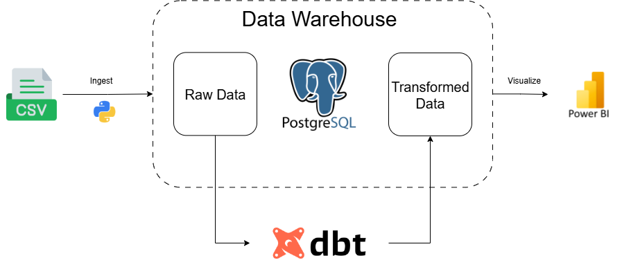
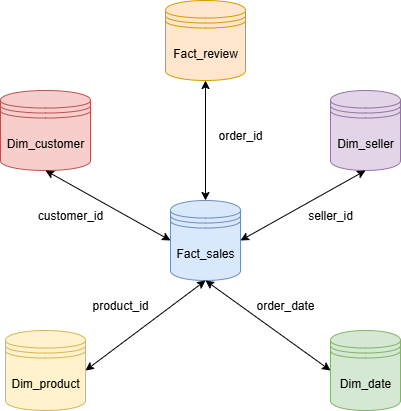
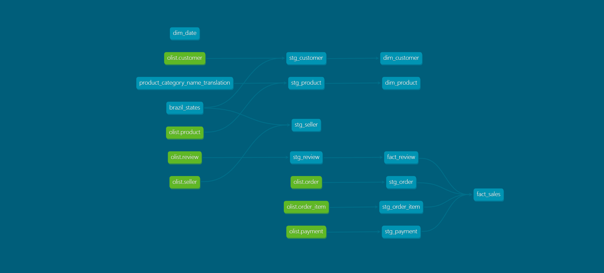
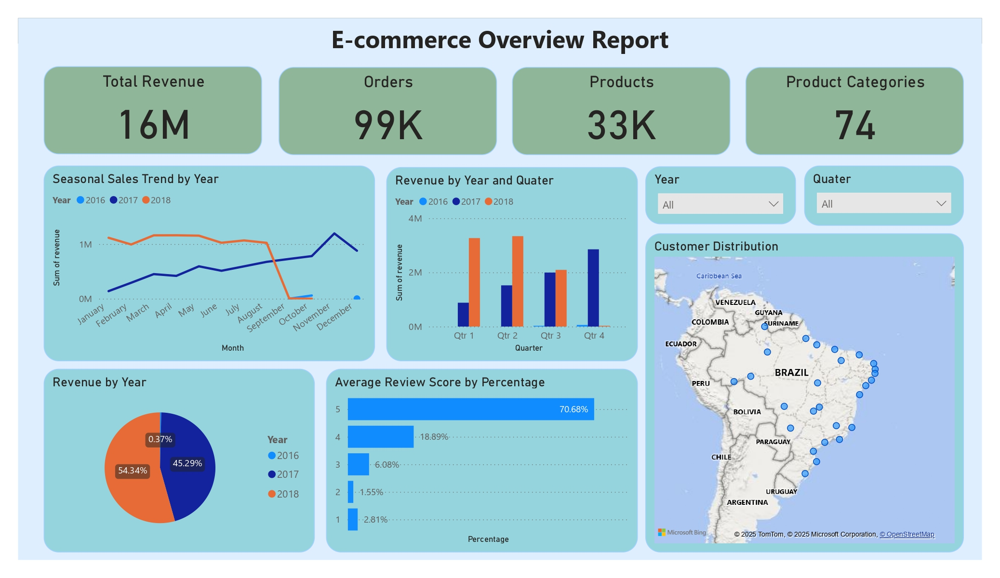

# Olist E-commerce Analytics Report Pipeline

## 📌 Overview and Datasets
This project analyzes the Brazilian e-commerce public dataset from **Olist**.  
The raw dataset includes multiple CSV files containing information on customers, orders, products, reviews, and payments.  

Key dataset entities:
- **Customers**: Customer details such as unique IDs, city, and state.
- **Sellers**: Seller details such as unique IDs, city, and state.
- **Orders**: Order details including timestamps, status, and delivery dates.
- **Order_items**: Order item details including order number, quantities, prices.  
- **Products**: Product metadata including category and dimensions.  
- **Reviews**: Customer reviews with rating scores and timestamps.  
- **Payments**: Payment method, installments, and values.  

**Original Olist Schema**:  

---

## ⚙️ Project Design / Techstack
This project is built with the following stack:  
- **dbt** for data transformation (staging → marts).  
- **Postgres** as the data warehouse.  
- **Power BI** for reporting and visualization.  
- **Olist dataset** (CSV) as the raw data source.
- **Python** for data ingestion into data warehouse.  

**Project Design Diagram**:  

---

## 🏗️ Transformed Schema (Marts Layer Design)
The marts layer is modeled using a **Star Schema** approach.  
It includes fact tables for sales and reviews, and dimension tables for customers, products, and dates.  

**Star Schema Diagram**:  

---

## 🔗 Data Model Lineage
The lineage of models and transformations can be explored through **dbt docs**.  
It shows the dependencies across staging and marts models.  

**Data Lineage Diagram**:  

---

## 📊 Visualization
The final output is an interactive **Power BI dashboard**.  
It provides insights into:
- Overview of revenue and products
- Sales trends over time.  
- Customer distribution.  
- Review scores and customer satisfaction.  

**Dashboard Preview**:  

---
